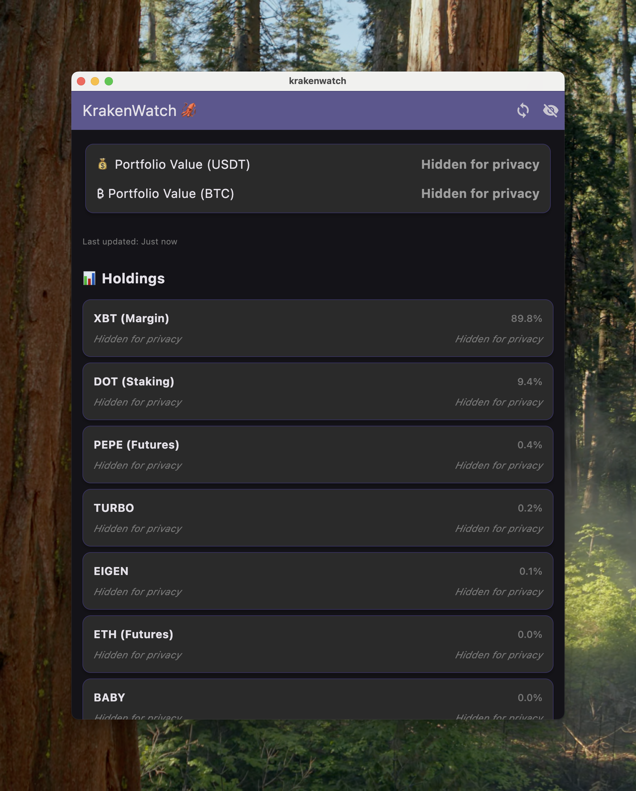

# KrakenWatch 🦑

A beautiful, privacy-focused portfolio tracker for Kraken cryptocurrency exchange that shows your complete portfolio in both USDT and BTC simultaneously.



## ✨ Features

- **📊 Complete Portfolio Overview**: View your entire Kraken portfolio with ALL holdings (including futures, staking, margin positions)
- **💰 Dual Currency Display**: See total portfolio value in both USDT and BTC at the same time
- **🔒 Privacy Mode**: Hide sensitive values with one tap - perfect for public viewing or screen sharing
- **⚡ Real-Time Sync**: Auto-refresh on startup + manual sync button in header
- **🎨 Kraken-Themed UI**: Beautiful dark theme with Kraken's signature purple colors
- **🔐 Secure & Read-Only**: Uses official Kraken API with minimal "Query Funds" permissions
- **📱 Native Performance**: Built with Flutter for smooth, native macOS experience

## 🎯 Why KrakenWatch?

The official Kraken app has limitations:
- ❌ Can only view portfolio in ONE currency at a time
- ❌ No comprehensive view of ALL holdings (futures, staking, etc.)
- ❌ No privacy mode for public viewing

KrakenWatch solves these problems by providing a complete, dual-currency portfolio overview with privacy controls.

## Getting Started

### Prerequisites

- Flutter SDK (managed via FVM)
- Kraken account with API access
- macOS (currently configured for macOS desktop)

### Setup

1. **Clone and install dependencies:**
   ```bash
   fvm flutter pub get
   ```

2. **Configure your Kraken API credentials:**
   - Follow instructions in [SETUP.md](SETUP.md) to get your API keys
   - Update `lib/config/api_config.dart` with your credentials

3. **Run the app:**
   ```bash
   fvm flutter run --device-id=macos
   ```

### API Permissions

This app requires **read-only** access to your Kraken account with the "Query Funds" permission enabled. It cannot make trades or withdrawals.

## Project Structure

```
lib/
├── config/
│   └── api_config.dart     # API credentials configuration
├── models/
│   └── balance.dart        # Data models for API responses
├── services/
│   └── kraken_api.dart     # Kraken API integration
└── main.dart               # Main app UI
```

## Security

- API credentials are kept in a separate config file
- The config file is excluded from version control
- Only read-only API permissions are required
- All API calls use proper HMAC-SHA512 authentication

## Contributing

This is a personal project, but feel free to fork and modify for your own use.
